# Evaluación 1

## Parte 2.

### Paso 1 - Configuración base:
- Crear y activar entorno virtual.
- Instalar Django.
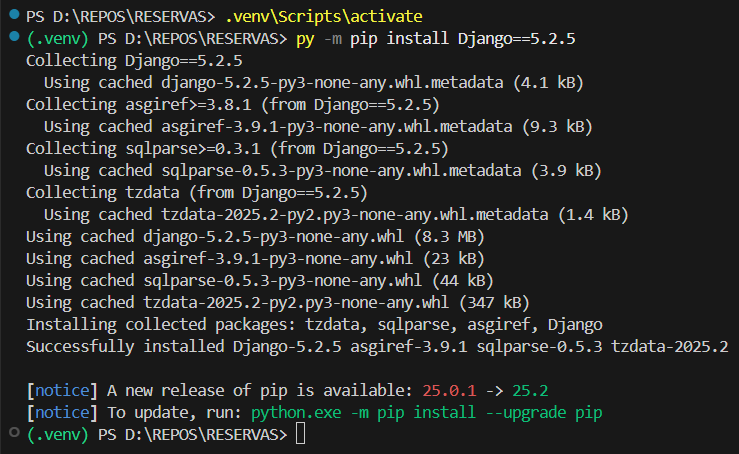

- Crear proyecto y aplicación.
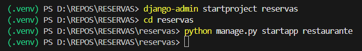

- Registrar la aplicación en el proyecto, y otras configuraciones.

    - En la lista INSTALLED_APPS agregar la app.
    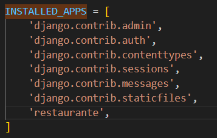

    - Cambiar LANGUAGE_CODE = 'en-us' por LANGUAGE_CODE = 'es-cl'.
    - Cambiar TIME_ZONE = 'UTC' por TIME_ZONE = 'America/Santiago'.
    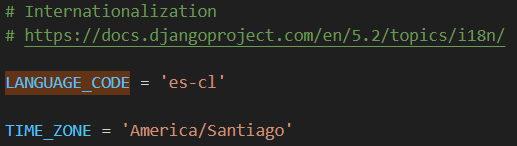

    - Generar la carpeta templates; cambiar 'DIRS': [], por 'DIRS': [BASE_DIR / 'templates'].
    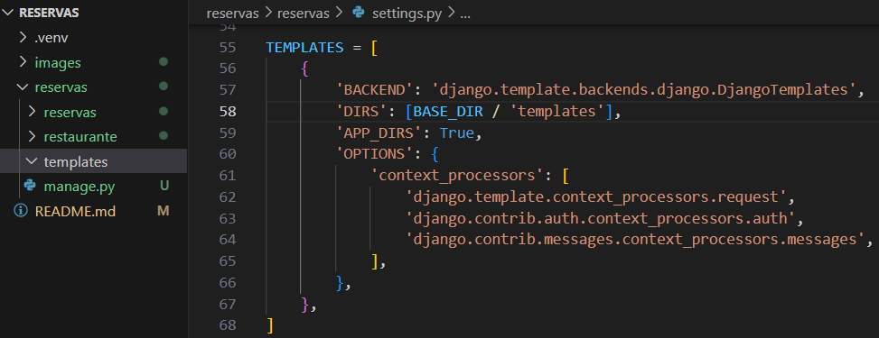

    - Ejecutar el servidor de desarrollo.
    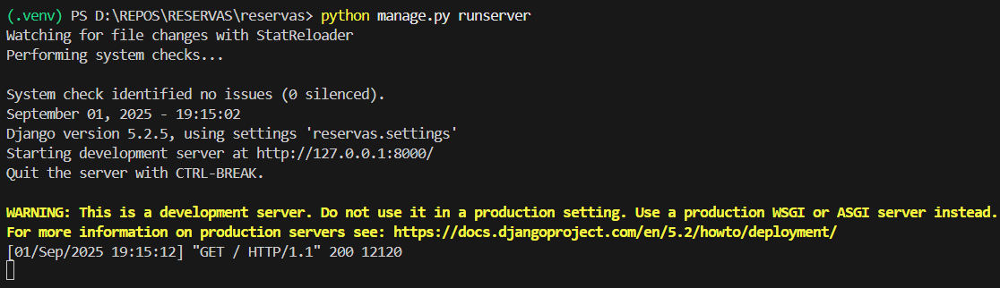

### Paso 2 - Definición de rutas:
- reservas/urls.py:
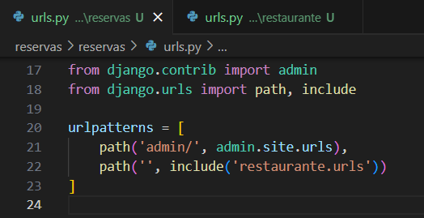

- restaurante/urls.py:

## Parte 3.

### Paso 1 - Definir modelos:
### Paso 2 - Migraciones:
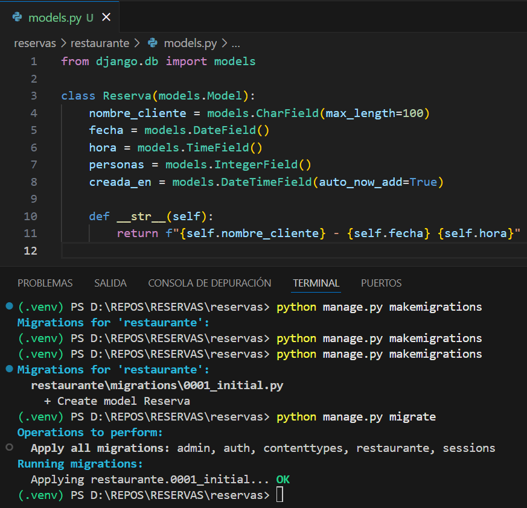

## Interfaz de Usuario (UI):
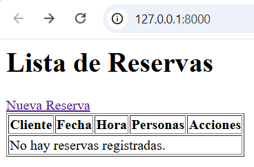

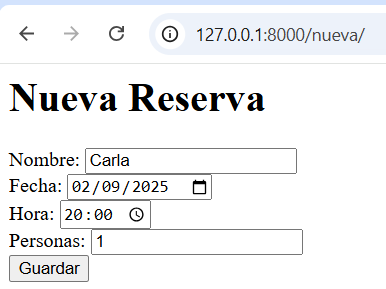

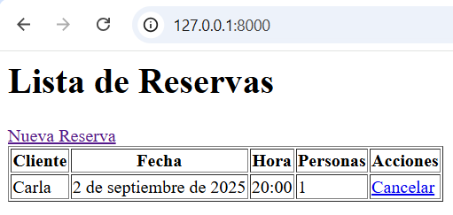
