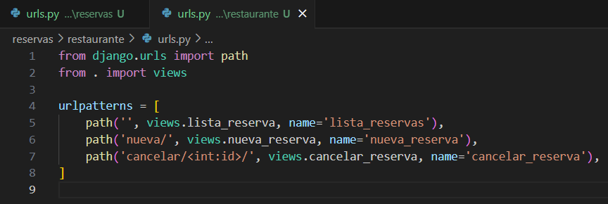

# Evaluación 1

## Parte 1 - Preguntas teóricas.

1. Servidor web vs servidor de aplicaciones:

Un servidor web como Nginx o Apache se encarga principalmente de manejar peticiones HTTP del cliente (como un navegador web). Su función básica es servir archivos estáticos: imágenes, HTML, CSS, JavaScript, etc. Por ejemplo, si alguien entra a *reservasrestaurante.com/logo.png*, el servidor web busca ese archivo en el sistema y lo entrega directamente.

En cambio, un servidor de aplicaciones como Gunicorn o uWSGI ejecuta código del backend, normalmente escrito en un lenguaje como Python (en el caso de Django o Flask). Este código procesa lógica compleja, accede a la base de datos, genera HTML dinámico, etc. Por ejemplo, cuando un usuario envía una reserva para una mesa, el servidor de aplicaciones procesa ese formulario, guarda los datos en la base de datos y devuelve una respuesta personalizada.

En resumen: El servidor web es como un camarero que entrega los platos que ya están listos. El servidor de aplicaciones es como el cocinero, que prepara el plato en el momento según lo que pidió el cliente.

Muchas veces se usan juntos: Nginx recibe la petición, sirve archivos estáticos directamente o la pasa a Gunicorn si necesita lógica dinámica.

2. Protocolo DNS:

El DNS (Domain Name System) actúa como una guía telefónica de Internet. Cuando escribes una dirección como *reservasrestaurante.com* en tu navegador, tu computadora no entiende nombres; necesita una dirección IP para comunicarse (como 192.0.2.1).

Entonces, el proceso DNS hace lo siguiente:

1. Tu computadora pregunta a un servidor DNS: “¿Cuál es la IP de *reservasrestaurante.com*?”
2. Si el DNS no la tiene en caché, va preguntando a otros servidores en la jerarquía de DNS (root, TLD, autoritativos) hasta encontrar la IP correcta.
3. Una vez que la tiene, se la da a la computadora, y ahora sí puede enviar la petición al servidor web correcto.

Es como buscar el número de teléfono de un restaurante para hacer una reserva: sabes el nombre, pero necesitas el número (IP) para comunicarte.

3. Modelo vs Vista en Django:

En Django, el patrón que se usa es MVT (Model-View-Template). Aquí se explican los dos componentes clave:

* El Modelo (Model) es la parte que define la estructura de los datos. Por ejemplo, si tienes una aplicación de reservas, el modelo podría ser una clase llamada `Reserva` con campos como `nombre`, `fecha`, `hora`, etc. Django usa estos modelos para crear y acceder a la base de datos fácilmente.

* La Vista (View) es el componente que recibe una solicitud del usuario, procesa la lógica (por ejemplo, consultar si hay mesas disponibles), y devuelve una respuesta (generalmente un HTML usando una plantilla). Las vistas no contienen el diseño visual, sino la lógica detrás de lo que se muestra.

Ejemplo de vida real:

* El modelo sería como la hoja de reservas escrita en el cuaderno del restaurante.
* La vista sería el mesero que revisa esa hoja y decide qué decirle al cliente.

4. HTTPS vs HTTP:

HTTP es el protocolo básico para que los navegadores se comuniquen con servidores web. El problema es que los datos se envían sin cifrar, es decir, cualquiera que intercepte la conexión (como alguien en una red Wi-Fi pública) podría ver los datos.

HTTPS es una versión segura de HTTP: usa cifrado SSL/TLS para proteger la información durante el trayecto. Eso significa que si un cliente está enviando su nombre, número de tarjeta o correo electrónico (como al hacer una reserva online o pedir comida), esos datos no pueden ser leídos por terceros.

Ventajas de HTTPS:

* Protección de datos sensibles (ideal en sistemas con login, pagos, formularios).
* Autenticación: garantiza que estás hablando con el servidor correcto y no con uno falso.
* Confianza del usuario: navegadores muestran advertencias si un sitio no es HTTPS.

Ejemplo claro: si haces un pedido online en *comidachinaexpress.com*, con HTTP tus datos personales van “en claro” como una postal. Con HTTPS, van como una carta cerrada: solo el destinatario puede leerla.

## Parte 2.

### Paso 1 - Configuración base:
- Crear y activar entorno virtual.
- Instalar Django.

- Crear proyecto y aplicación.

- Registrar la aplicación en el proyecto, y otras configuraciones.

    - En la lista INSTALLED_APPS agregar la app.

    

    - Cambiar LANGUAGE_CODE = 'en-us' por LANGUAGE_CODE = 'es-cl'.
    - Cambiar TIME_ZONE = 'UTC' por TIME_ZONE = 'America/Santiago'.

    

    - Generar la carpeta templates; cambiar 'DIRS': [], por 'DIRS': [BASE_DIR / 'templates'].

    

    - Ejecutar el servidor de desarrollo.

    

### Paso 2 - Definición de rutas:
- reservas/urls.py:

- restaurante/urls.py:

## Parte 3.

### Paso 1 - Definir modelos:
### Paso 2 - Migraciones:

## Interfaz de Usuario (UI):

